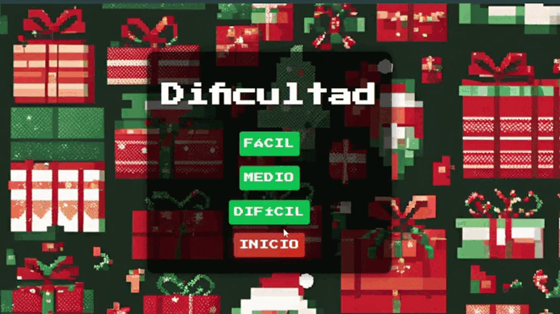

# 🎄 Xmas Memory Game 🎅
Un mágico juego de memoria navideño donde la diversión y los recuerdos se encuentran. ¡Encuentra los pares y desbloquea el espíritu festivo! ✨

---

<p align="center">
  
</p>

---

## ⭐​Demo

<p align="center">
  
</p>

---

## 🌟 Descripción

Sumérgete en la magia navideña con este encantador juego de memoria donde deberás encontrar pares de cartas coincidentes. Con tres niveles de dificultad y una progresión desafiante, ¡cada partida es una nueva aventura festiva!

---

## 🎮 Características Principales

🎯 **Múltiples Dificultades**

- Fácil: Para principiantes
- Medio: Un desafío equilibrado
- Difícil: Para expertos memoristas

🏆 **Sistema de Niveles**

- 5 niveles progresivos por dificultad
- Incremento gradual de desafío
- Sistema de puntuación motivador

🎨 **Diseño**

- Temática navideña encantadora
- Interfaz retro con fuente "Press Start 2P"
- Diseño responsivo para todas las pantallas

---

## 📊 Niveles y Puntuación

### 🟢 Modo Fácil

```
Nivel 1 ➜ 4 cartas (2 pares)  [5 puntos]
Nivel 2 ➜ 8 cartas (4 pares)  [5 puntos]
Nivel 3 ➜ 12 cartas (6 pares) [5 puntos]
Nivel 4 ➜ 16 cartas (8 pares) [5 puntos]
Nivel 5 ➜ 20 cartas (10 pares)[5 puntos]
```

### 🟡 Modo Medio

```
Nivel 1 ➜ 6 cartas (3 pares)  [10 puntos]
Nivel 2 ➜ 10 cartas (5 pares) [15 puntos]
Nivel 3 ➜ 14 cartas (7 pares) [20 puntos]
Nivel 4 ➜ 18 cartas (9 pares) [25 puntos]
Nivel 5 ➜ 22 cartas (11 pares)[30 puntos]
```

### 🔴 Modo Difícil

```
Nivel 1 ➜ 8 cartas (4 pares)   [15 puntos]
Nivel 2 ➜ 12 cartas (6 pares)  [15 puntos]
Nivel 3 ➜ 16 cartas (8 pares)  [15 puntos]
Nivel 4 ➜ 20 cartas (10 pares) [15 puntos]
Nivel 5 ➜ 24 cartas (12 pares) [15 puntos]
```

---

## 📁 Estructura del Proyecto

```bash
📦 XMAS-MEMORY
├── 📄 index.html          # Página principal
├── 📄 dificultad.html     # Selector de dificultad
├── 📄 facil.html          # Juego nivel fácil
├── 📄 medio.html          # Juego nivel medio
├── 📄 dificil.html        # Juego nivel difícil
├── 📂 js/
│   ├── 📜 facil.js       # Lógica fácil
│   ├── 📜 medio.js       # Lógica medio
│   └── 📜 dificil.js     # Lógica difícil
├── 📂 css/
│   ├── 🎨 inicio.css     # Estilos inicio
│   ├── 🎨 dificultad.css # Estilos dificultad
│   ├── 🎨 facil.css      # Estilos fácil
│   ├── 🎨 medio.css      # Estilos medio
│   └── 🎨 dificil.css    # Estilos difícil
└── 📂 assets/            # Imágenes navideñas
```

---

## 🎯 Cómo Jugar

1. 🚀 Abre `index.html` en tu navegador favorito
2. 🎮 Presiona "Comenzar" para iniciar la aventura
3. 🎯 Elige tu nivel de dificultad
4. 🔍 Encuentra los pares de cartas navideñas
5. ⭐ Completa los 5 niveles para convertirte en el maestro de la memoria navideña

---

## 🛠️ Tecnologías Utilizadas

<p align="center">
  
  
  
</p>

---

## 🎁 Funciones Principales

```javascript
// Baraja las cartas mágicamente
function shuffledArray(array) {
  return array.sort(() => Math.random() - 0.5);
}

// Crea el tablero festivo
function createBoard() {
  // Magia navideña aquí
}

// Voltea las cartas con alegría
function flipCard(event) {
  // Más magia navideña
}
```

---

## ✨ Consejos para Jugar

1. 👀 Concéntrate en la ubicación de cada carta
2. 🧠 Toma tu tiempo para memorizar
3. 📝 Intenta hacer la menor cantidad de movimientos
4. 🌟 ¡Diviértete y disfruta de la magia navideña!

---

<div align="center">
🎄 ¡Feliz Navidad y Feliz Juego! 🎅
Hecho con ❤️ y espíritu navideño
</div>

---

## 👤 Autor

Desarrollado por **Stefany Pérez**  
GitHub: [@StefanyPerezBz](https://github.com/StefanyPerezBz)
